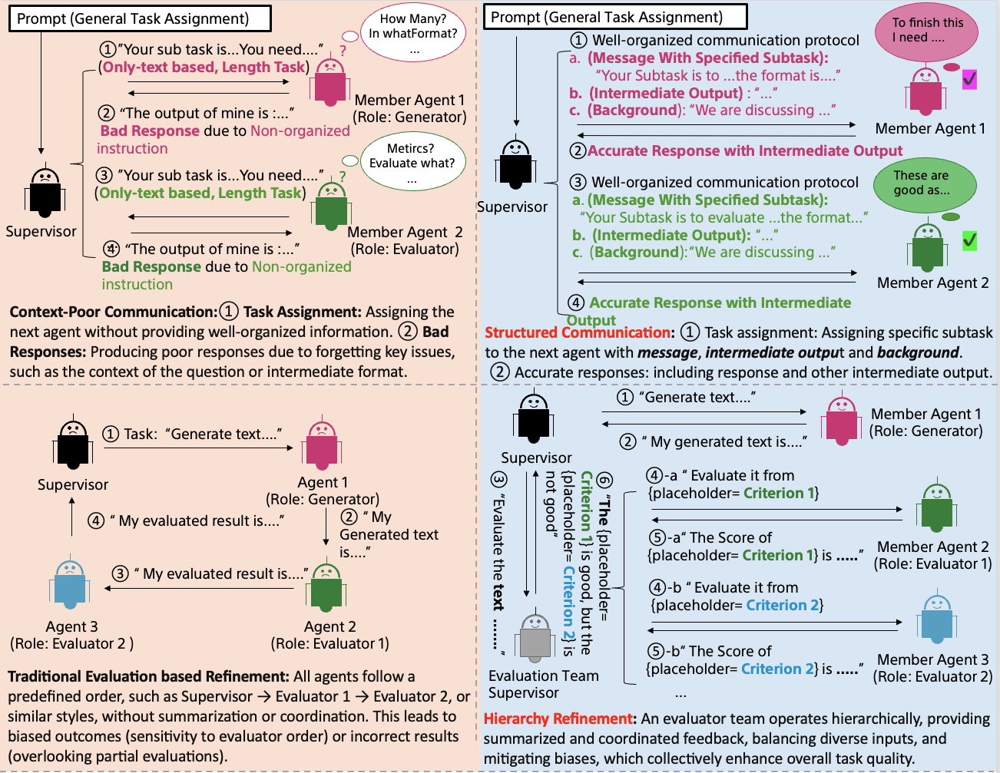

# Talk Structurally, Act Hierarchically: A Collaborative Framework for LLM Multi-Agent Systems

## Overview
This repository contains the official implementation of the multi-agent LLM system described in the paper [**“Talk Structurally, Act Hierarchically: A Collaborative Framework for LLM Multi-Agent Systems”**](https://arxiv.org/abs/2502.11098) by Zhao Wang, Moriyama Sota, Wei-Yao Wang, Briti Gangopadhyay and Shingo Takamatsu. For simplicity, we refer to our model as ***TalkHier***. ***TalkHier*** models hierarchical agent communication to efficiently solve complex tasks by leveraging structured conversations. It introduces a novel framework that establishes a structured communication protocol for context-rich exchanges and a hierarchical refinement system to address issues such as incorrect outputs, falsehoods, and biases.

## Architecture

Figure 1: Comparisons between existing approaches (left) and ***TalkHier*** (right). ***TalkHier*** proposes a new communication protocol (first row) featuring context-rich and well-structured communication information, along with a collaborative hierarchical refinement (second row) where evaluations provide summarized and coordinated feedback within an LLM-MA framework

***TalkHier*** consists of two types of agents:
- **Supervisor Agents**: Responsible for selecting which member agent should communicate next.
- **Member Agents**: Execute tasks and report back to the supervisor.

Each task defines its own **graph-based structure**, ensuring that communication pathways are dynamically determined based on the input problem.

## General Performance on MMLU Dataset

The table reports accuracy (%) for various baselines across Moral Scenario (Moral), College Physics (Phys.), Machine Learning (ML), Formal Logic (FL), and US Foreign Policy (UFP) domains. The notations **3@**, **5@**, and **7@** represent majority voting results using 3, 5, and 7 independent runs, respectively.

| **Models**       | **Moral** | **Phys.** | **ML**  | **FL**  | **UFP**  | **Avg.**  |
|-----------------|---------|---------|------|------|------|------|
| GPT4o      | 64.25   | 62.75   | 67.86 | 63.49 | 92.00 | 70.07 |
| GPT4o-3@   | 65.70   | 62.75   | 66.07 | 66.67 | 91.00 | 70.44 |
| GPT4o-5@   | 66.15   | 61.76   | 66.96 | 66.67 | 92.00 | 70.71 |
| GPT4o-7@   | 65.81   | 63.73   | 66.96 | 68.25 | 91.00 | 71.15 |
| ReAct      | 69.61   | 72.55   | 59.82 | 32.54 | 58.00 | 58.50 |
| ReAct-3@   | 74.75   | 83.33   | 66.07 | 52.38 | 53.00 | 65.91 |
| ReAct-5@   | 74.97   | 82.35   | 66.96 | 46.83 | 63.00 | 66.82 |
| ReAct-7@   | 75.53   | 84.78   | 67.86 | 50.79 | 57.00 | 67.19 |
| AutoGPT    | 66.37   | 78.43   | 64.29 | 60.83 | 90.00 | 71.98 |
| AgentVerse | 79.11   | 93.14   | 79.46 | 78.57 | 88.00 | 83.66 |
| GPTSwarm   | 60.48   | 67.70   | 72.32 | 68.33 | 57.00 | 65.17 |
| AgentPrune | 70.84   | 91.18   | 81.25 | 81.75 | 93.00 | 83.60 |
| o1-preview | 82.57   | 91.17   | **85.71** | 83.33 | **95.00** | 87.56 |
| ***TalkHier (Ours)*** | **83.80** | **93.14** | 84.68 | **87.30** | 93.00 | **88.38** |

## Evaluation Results on WikiQA

The table reports **Rouge-1** and **BERTScore** for various models.

| **Models**         | **Rouge-1** | **BERTScore** |
|--------------------|------------|--------------|
| GPT4o            | 0.2777     | 0.5856       |
| ReAct            | 0.2409     | 0.5415       |
| AutoGPT      | 0.3286     | 0.5885       |
| AgentVerse   | 0.2799     | 0.5716       |
| AgentPrune   | 0.3027     | 0.5788       |
| GPTSwarm     | 0.2302     | 0.5067       |
| o1-preview  | 0.2631     | 0.5701       |
| ***TalkHier (Ours)***| **0.3461** | **0.6079**   |

## Evaluation Results on Camera Dataset

We report **BLEU-4 (B4), ROUGE-1 (R1), BERTScore (BERT), and domain-specific metrics** (Faithfulness, Fluency, Attractiveness, Character Count Violation (CCV)) following [CyberAgent Camera](#).

| **Models**         | **B4 (↑)** | **R1 (↑)** | **BERT (↑)** | **Faithfulness (↑)** | **Fluency (↑)** | **Attractiveness (↑)** | **CCV (↓)**  |
|--------------------|---------|---------|---------|--------------|---------|--------------|---------|
| **GPT-4o**        | 0.01    | 0.02    | 0.65    | 4.8          | 5.9     | 6.5          | 16%     |
| **ReAct**         | 0.01    | 0.01    | 0.70    | 4.9          | 6.4     | **7.0**      | 17%     |
| **OKG**           | 0.03    | 0.16    | 0.73    | 6.3          | 8.7     | 6.1          | **4%**  |
| *TalkHier (Ours)* | **0.04** | **0.20** | **0.91** | **8.6** | **8.9** | 6.2 | **4%** |

## Ablative Results: Accuracy (%) Across Physics, ML, and Moral Domains

The study examines the impact of removing components from the structured communication protocol:  
- **Message (\(\mathbf{M}_{ij}\))**  
- **Background (\(\mathbf{B}_{ij}\))**  
- **Intermediate Output (\(\mathbf{I}_{ij}\))**

| **Models**                 | **Moral** | **Phys.** | **ML**  | **Avg.**  |
|----------------------------|---------|---------|------|------|
| w/o **\(\mathbf{I}_{ij}\)** | 81.56   | 90.20   | 75.89 | 82.55 |
| w/o **\(\mathbf{B}_{ij}\)** | 76.87   | 87.50   | 70.54 | 78.30 |
| w/o **\(\mathbf{B}_{ij}, \mathbf{I}_{ij}\)** | 77.99 | 90.20 | 78.57 | 82.25 |
| *TalkHier (Ours)*          | **83.80** | **93.14** | **84.68** | **87.21** |

## Ablative Results on Main Components of *TalkHier*

The table presents accuracy (%) across Physics, ML, and Moral domains.  
- *TalkHier* w/o Eval. Sup. removes the evaluation supervisor.  
- *TalkHier* w/o Eval. Team excludes the evaluation team component.  
- *TalkHier* w. Norm. Comm uses a normalized communication protocol.

| **Models**               | **Moral** | **Phys.** | **ML**  | **Avg.**  |
|--------------------------|---------|---------|------|------|
| w/o Eval. Sup.          | 83.57   | 87.25   | 74.77 | 81.86 |
| w/o Eval. Team          | 73.54   | 80.34   | 74.56 | 76.15 |
| w. Norm. Comm           | 82.91   | 88.24   | 82.14 | 84.43 |
| React (Single Agent)    | 69.61   | 72.55   | 59.82 | 67.33 |
| ***TalkHier (Ours)***   | **83.80** | **93.14** | **84.68** | **87.21** |
## Installation

### Manual Installation
To set up the environment manually, follow these steps:
```sh
# 1. Unzip the zip file

# 2. Enter the folder
cd TalkHier

# 3. Create a virtual environment
python -m venv env
source env/bin/activate  # On Windows use `env\\Scripts\\activate`

# 4. Install dependencies
pip install -r requirements.txt
```

### Docker Compose Installation
To set up the system using Docker Compose:
```sh
# 1. Unzip the zip file

# 2. Enter the folder
cd TalkHier/docker

# Build and start the container
docker-compose up --build
```
This will use the `Dockerfile` to build the necessary environment and start the system.

## Usage
To run the system, execute the following command:
```sh
python experiments.py --mode [Problem]
```

### Configuration
Modify `config/config_llm.ini` and add the keys.

```sh
[KEYS]

SERPAPI_API_KEY = *************************************

OPENAI_API_KEY = *************************************

OPENAI_ENDPOINT = *************************************
```

**Need to replace your own key**

```sh
[LLM]

deployment_name=*******

openai_api_version=**********
```
**Need to set up Open AI API version**


## Examples
To test the system with a predefined task:
```sh
python experiments.py --mode moral_scenario
```

## License
This project is licensed under the [Attribution-NonCommercial 4.0 International Lisence](https://creativecommons.org/licenses/by-nc/4.0/legalcode.en).

## Contributing
Contributions are welcome! Please fork the repository and submit a pull request for any improvements or bug fixes.

## Contact
For any questions or issues, feel free to reach out: Zhao.Wang@sony.com or this github repo for any information.

## Cite
If you use or reference ***TalkHier***, please cite us with the following BibTeX entry:
```bibtex
@misc{wang2025talkhier,
      title={Talk Structurally, Act Hierarchically: A Collaborative Framework for LLM Multi-Agent Systems}, 
      author={Zhao Wang and Sota Moriyama and Wei-Yao Wang and Briti Gangopadhyay and Shingo Takamatsu},
      year={2025},
      eprint={2502.11098},
      archivePrefix={arXiv},
      primaryClass={cs.AI},
      url={https://arxiv.org/abs/2502.11098}, 
}
```

## Star History

[](https://star-history.com/#sony/talkhier&Date)


